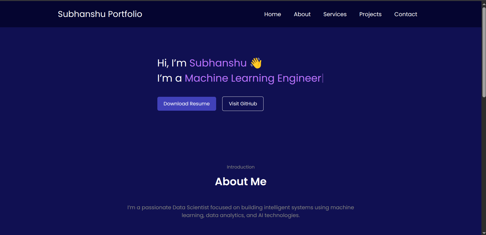
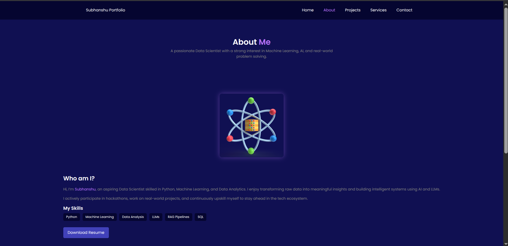
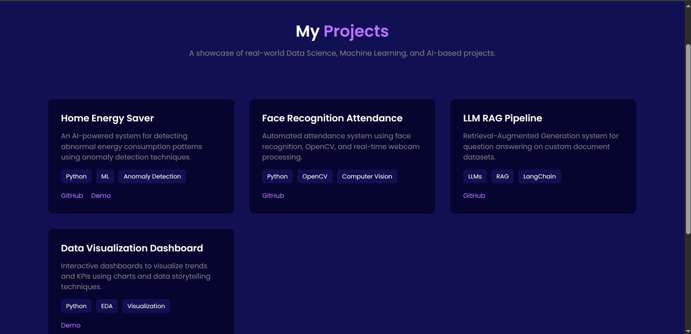
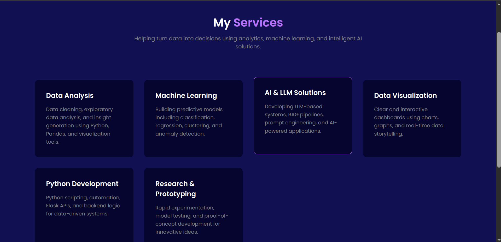
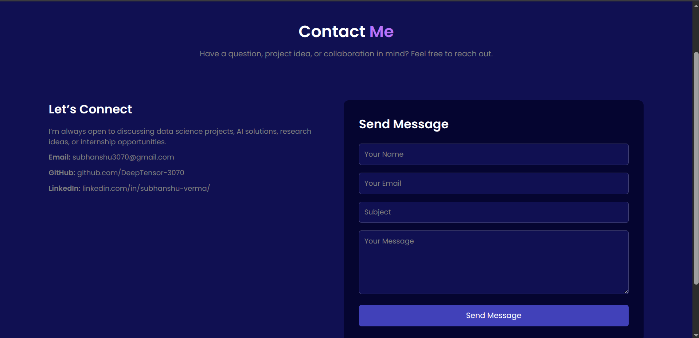

## WEB Desiging Project

* Title: Personal Portfolio Create a portfolio website that showcases your skills, projects, and resume. Include a blog section where you can share your thoughts on web development.

This is personal portfolio website for Web Designing Lab , showcasing my background, projects, and skills in Data Science, Artificial Intelligence, and Machine Learning. The website highlights my work, services, and contact information in a clean, modern, and responsive design.

It is built using HTML, CSS, and JavaScript, focusing on simplicity, performance, and user experience. This portfolio serves as a central hub for recruiters, collaborators, and anyone interested in my work.

## Screenshots
### 🏠 Home Page

### 👤 About Section

### 💼 Projects Section

### Services Section

### 📩 Contact Page

## 🛠️ Tech Stack
- HTML
- CSS
- Javascript

### Features
- Clean & Modern UI
- Paper Preparation
- Contact form with Validation
- Easy Navigation

### Future Improvements
- Backend integration for contact form
- Blog Section
- Project filtering & animations

## 📂 Folder Section
├── screenshots/
├── static/
│   └── contact.css
    └── about.css
    └── index.css
    └── project.css
    └── services.css
├── index.html
├── about.html
├── project.html
├── services.html
├── contact.html
└── readme.md
